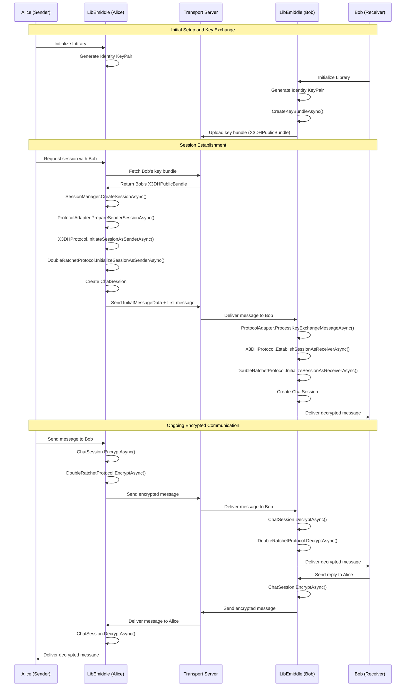

# 1-to-1 Chat Sequence Diagram

This diagram shows the complete flow of establishing a 1-to-1 encrypted chat session between Alice and Bob using LibEmiddle.

## Key Components

### Protocol Stack
- **X3DH Protocol**: Extended Triple Diffie-Hellman for initial key agreement
- **Double Ratchet Protocol**: Provides forward secrecy and post-compromise security
- **SessionManager**: Manages chat session lifecycle
- **ProtocolAdapter**: Coordinates between protocol layers

### Security Features
- **Perfect Forward Secrecy**: Each message uses unique encryption keys
- **Post-Compromise Security**: Future messages remain secure even if past keys are compromised
- **Authenticated Encryption**: Messages are both encrypted and authenticated
- **Key Rotation**: Continuous key evolution through Double Ratchet

### Flow Summary
1. **Initialization**: Both parties initialize LibEmiddle and generate identity keys
2. **Key Bundle Upload**: Bob uploads his public key bundle to the server
3. **Session Initiation**: Alice fetches Bob's keys and initiates X3DH key exchange
4. **Message Delivery**: First message includes key exchange data for Bob to establish session
5. **Session Established**: Both parties now have a shared ChatSession for ongoing communication
6. **Encrypted Messaging**: All subsequent messages use Double Ratchet encryption