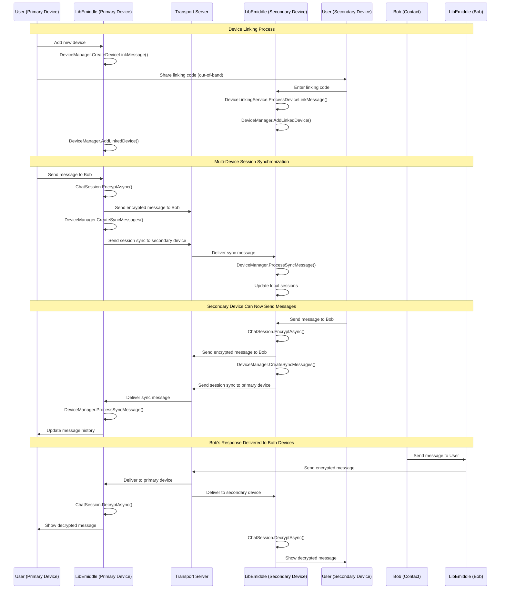

# Device Linking Sequence Diagram

This diagram shows the complete flow of linking a secondary device to a primary device in LibEmiddle's multi-device architecture.

## Key Components

### Device Management
- **DeviceManager**: Central coordinator for multi-device operations
- **DeviceLinkingService**: Handles secure device pairing process
- **SyncMessageValidator**: Ensures sync message integrity across devices

### Linking Process
1. **Link Code Generation**: Primary device creates secure linking message
2. **Out-of-Band Sharing**: Linking code shared through secure external channel
3. **Device Registration**: Secondary device processes link and registers with primary
4. **Mutual Recognition**: Both devices add each other to their device lists

### Session Synchronization
- **Automatic Sync**: All session state changes are automatically synchronized
- **Bidirectional Updates**: Both devices can initiate and receive sync messages
- **Consistent State**: All linked devices maintain identical session state

### Security Features
- **Secure Linking**: Device linking uses cryptographic proof of possession
- **Session Isolation**: Each device maintains independent encryption keys
- **Synchronized Forward Secrecy**: Key rotation is coordinated across devices
- **Message Consistency**: All devices receive and can decrypt the same messages

### Multi-Device Benefits
- **Seamless Experience**: Users can switch between devices transparently
- **Message History**: Full conversation history available on all linked devices
- **Real-time Sync**: Messages and session updates propagated immediately
- **Device Independence**: Each device can operate independently when needed