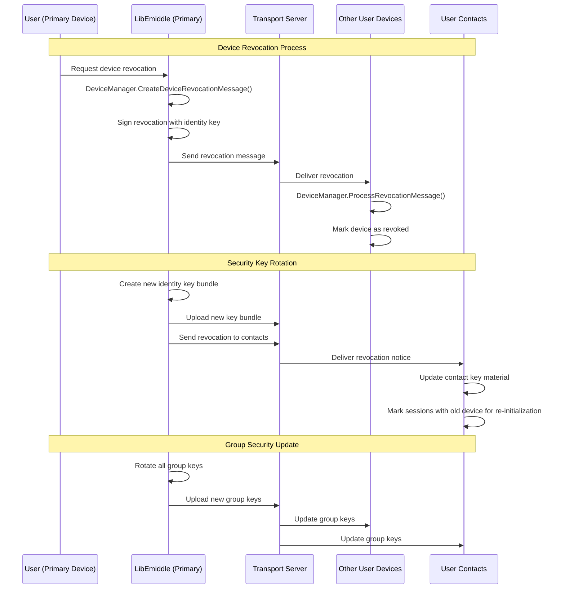

# Device Revocation Sequence Diagram

This diagram shows the complete flow of revoking a compromised or lost device in LibEmiddle's multi-device architecture.

## Key Components

### Device Revocation Management
- **DeviceManager**: Handles device lifecycle and revocation processes
- **Cryptographic Signatures**: Revocation messages signed with identity keys
- **Distributed Notification**: All affected parties notified of revocation

### Security Measures
1. **Immediate Isolation**: Revoked device marked as untrusted across network
2. **Key Rotation**: All identity and session keys regenerated
3. **Contact Notification**: All contacts informed of device revocation
4. **Group Key Updates**: All group conversations get new encryption keys

### Revocation Process Flow

#### Phase 1: Device Revocation
- User initiates revocation from trusted device
- Cryptographically signed revocation message created
- All user's other devices notified and mark device as revoked

#### Phase 2: Key Material Rotation
- Primary device generates new identity key bundle
- New keys uploaded to replace compromised keys
- Contacts receive notification of key material changes

#### Phase 3: Session Re-establishment
- Contacts mark old sessions for re-initialization
- New sessions established using fresh key material
- All group memberships updated with new keys

### Security Benefits
- **Forward Secrecy**: Past messages remain secure even if device compromised
- **Post-Compromise Security**: New messages secure after revocation
- **Network Effect**: Revocation propagates to all connected parties
- **Granular Control**: Individual device revocation without affecting others

### Recovery Scenarios
- **Lost Device**: Immediate revocation prevents unauthorized access
- **Stolen Device**: Remote revocation invalidates all sessions
- **Compromised Device**: Key rotation ensures future security
- **Planned Replacement**: Controlled migration to new device

### Implementation Notes
- Revocation messages include timestamp and device identifier
- Cryptographic proof prevents spoofed revocation requests
- Grace period may apply for temporary connectivity issues
- Emergency revocation available through out-of-band channels