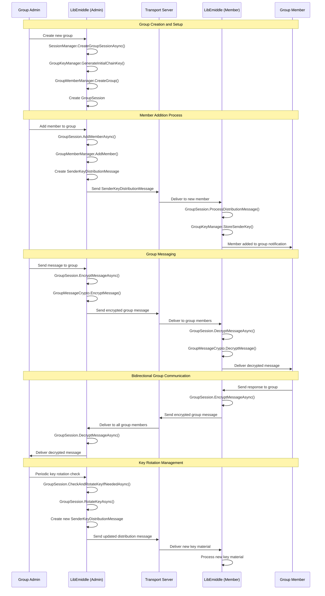

# Group Chat Sequence Diagram

This diagram shows the complete flow of creating a group chat, adding members, and conducting encrypted group conversations in LibEmiddle.

## Key Components

### Group Session Management
- **SessionManager**: Coordinates group session creation and lifecycle
- **GroupKeyManager**: Manages encryption keys and key rotation
- **GroupMemberManager**: Handles member addition, removal, and permissions
- **GroupSession**: Main interface for group communication

### Encryption Architecture
- **Sender Keys**: Each participant generates unique sender keys for group encryption
- **SenderKeyDistributionMessage**: Distributes sender keys securely to group members
- **GroupMessageCrypto**: Handles group-specific encryption and decryption operations
- **Chain Keys**: Hierarchical key derivation for forward secrecy

### Group Communication Flow

#### Phase 1: Group Creation
1. Admin creates new group with initial configuration
2. Group keys generated and GroupSession established
3. Admin becomes first member with administrative privileges

#### Phase 2: Member Addition
1. Admin initiates member addition process
2. New SenderKeyDistributionMessage created for new member
3. Key material securely distributed to new member
4. Member processes and stores sender keys for group

#### Phase 3: Encrypted Messaging
1. Messages encrypted using sender's current chain key
2. Encrypted messages distributed to all group members
3. Recipients decrypt using appropriate sender key material
4. Bidirectional communication supported for all members

#### Phase 4: Key Rotation
1. Periodic or triggered key rotation checks
2. New key material generated when rotation needed
3. Updated keys distributed to all group members
4. Seamless transition to new encryption keys

### Security Features
- **Forward Secrecy**: Each message uses unique encryption keys
- **Group Authentication**: All messages cryptographically authenticated
- **Member Verification**: Each member's identity verified through key distribution
- **Scalable Encryption**: Efficient group encryption regardless of member count

### Administrative Controls
- **Member Management**: Add/remove members with proper authorization
- **Key Rotation Policies**: Configurable key rotation intervals and triggers
- **Group Permissions**: Role-based access control (admin, member, etc.)
- **Audit Trail**: All group operations logged for security review

### Performance Optimizations
- **Efficient Key Distribution**: Minimizes overhead for key updates
- **Parallel Processing**: Messages can be encrypted/decrypted concurrently
- **Selective Delivery**: Only active members receive messages
- **Caching Strategy**: Frequently used keys cached for performance