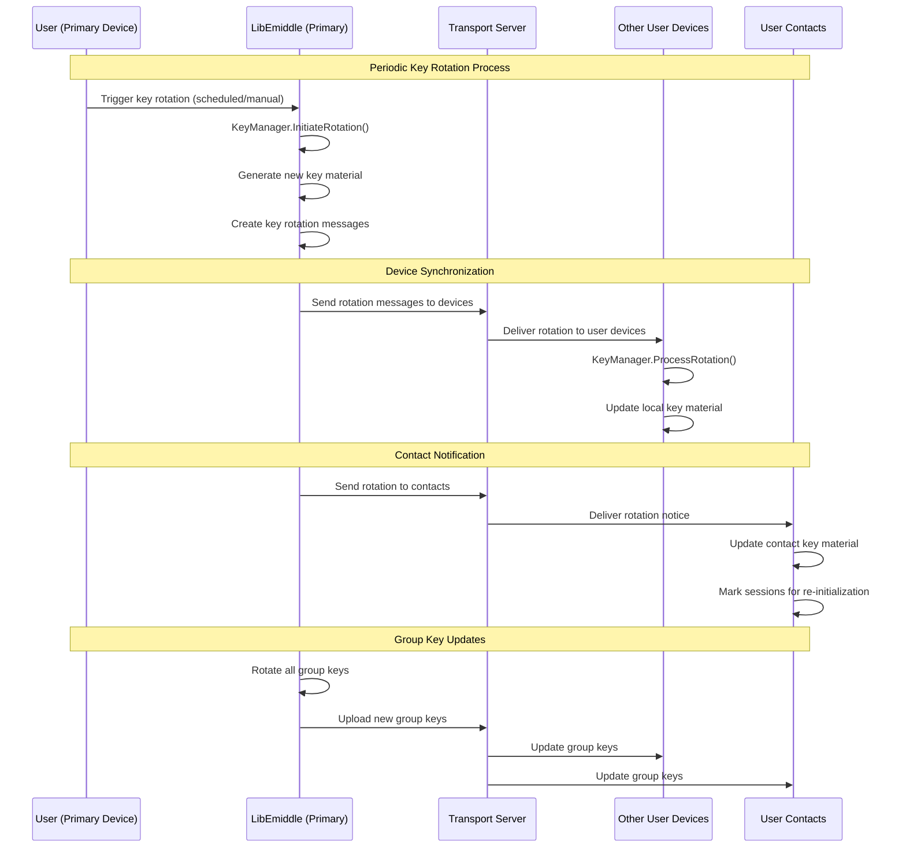

# Key Rotation Sequence Diagram

This diagram shows the complete flow of key rotation in LibEmiddle's security architecture, including coordinated rotation across devices and contacts.

## Key Components

### Key Rotation Management
- **KeyManager**: Central coordinator for all key rotation operations
- **Rotation Policies**: Time-based, usage-based, and event-triggered rotation
- **Key Versioning**: Maintains compatibility during transition periods
- **Atomic Updates**: Ensures consistent key state across all entities

### Rotation Triggers
1. **Scheduled Rotation**: Automatic rotation based on time intervals
2. **Usage-Based Rotation**: Triggered by message count or data volume
3. **Security Events**: Immediate rotation on compromise detection
4. **Manual Rotation**: User-initiated rotation for security purposes

### Multi-Device Coordination
- **Primary Device Control**: Main device orchestrates rotation process
- **Synchronized Updates**: All devices receive new keys simultaneously
- **Consistency Verification**: Rotation completion confirmed across devices
- **Rollback Capability**: Can revert to previous keys if issues occur

### Contact Integration
- **Notification System**: Contacts informed of key material changes
- **Session Re-establishment**: Existing sessions marked for renewal
- **Gradual Transition**: Old and new keys valid during transition period
- **Verification Process**: Contact key updates cryptographically verified

### Group Key Rotation
- **Coordinated Updates**: All group members receive new keys
- **Admin Privileges**: Group administrators can force key rotation
- **Member Synchronization**: Ensures all participants have current keys
- **Backward Compatibility**: Temporary support for mixed key versions

### Security Benefits
- **Forward Secrecy**: Future messages secure even if current keys compromised
- **Post-Compromise Security**: Past messages remain secure after key renewal
- **Quantum Resistance**: Regular rotation mitigates long-term quantum threats
- **Attack Surface Reduction**: Limits exposure window for compromised keys

### Performance Considerations
- **Efficient Distribution**: Minimizes network overhead for key updates
- **Parallel Processing**: Multiple rotations can occur simultaneously
- **Caching Strategy**: Frequently accessed keys cached for performance
- **Load Balancing**: Rotation schedules distributed to prevent congestion

### Monitoring and Compliance
- **Rotation Auditing**: Complete logs of all key rotation activities
- **Compliance Reporting**: Supports regulatory key management requirements
- **Health Monitoring**: Tracks rotation success rates and timing
- **Alert System**: Notifications for failed or overdue rotations