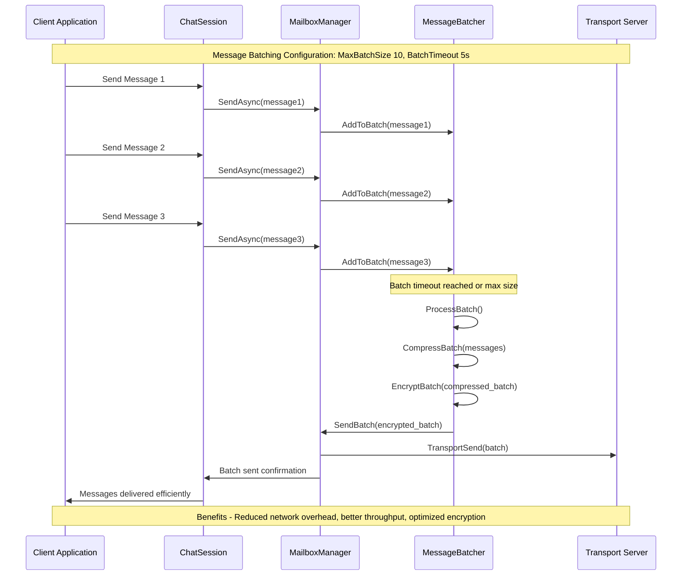

```mermaid
sequenceDiagram
    participant Client as Client Application
    participant ChatSession as ChatSession
    participant MailboxManager as MailboxManager
    participant MessageBatcher as MessageBatcher
    participant Server as Transport Server

    Note over Client, Server: Message Batching Configuration: MaxBatchSize 10, BatchTimeout 5s

    Client->>ChatSession: Send Message 1
    ChatSession->>MailboxManager: SendAsync(message1)
    MailboxManager->>MessageBatcher: AddToBatch(message1)

    Client->>ChatSession: Send Message 2
    ChatSession->>MailboxManager: SendAsync(message2)
    MailboxManager->>MessageBatcher: AddToBatch(message2)

    Client->>ChatSession: Send Message 3
    ChatSession->>MailboxManager: SendAsync(message3)
    MailboxManager->>MessageBatcher: AddToBatch(message3)

    Note over MessageBatcher: Batch timeout reached or max size

    MessageBatcher->>MessageBatcher: ProcessBatch()
    MessageBatcher->>MessageBatcher: CompressBatch(messages)
    MessageBatcher->>MessageBatcher: EncryptBatch(compressed_batch)
    MessageBatcher->>MailboxManager: SendBatch(encrypted_batch)
    MailboxManager->>Server: TransportSend(batch)
    MailboxManager->>ChatSession: Batch sent confirmation
    ChatSession->>Client: Messages delivered efficiently
    Note over Client, Server: Benefits - Reduced network overhead, better throughput, optimized encryption
```