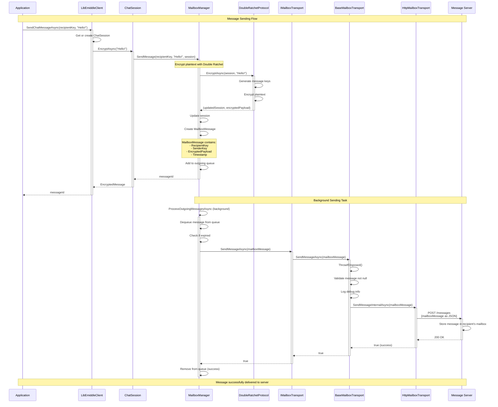
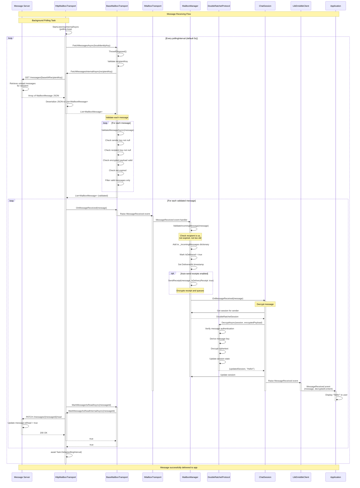
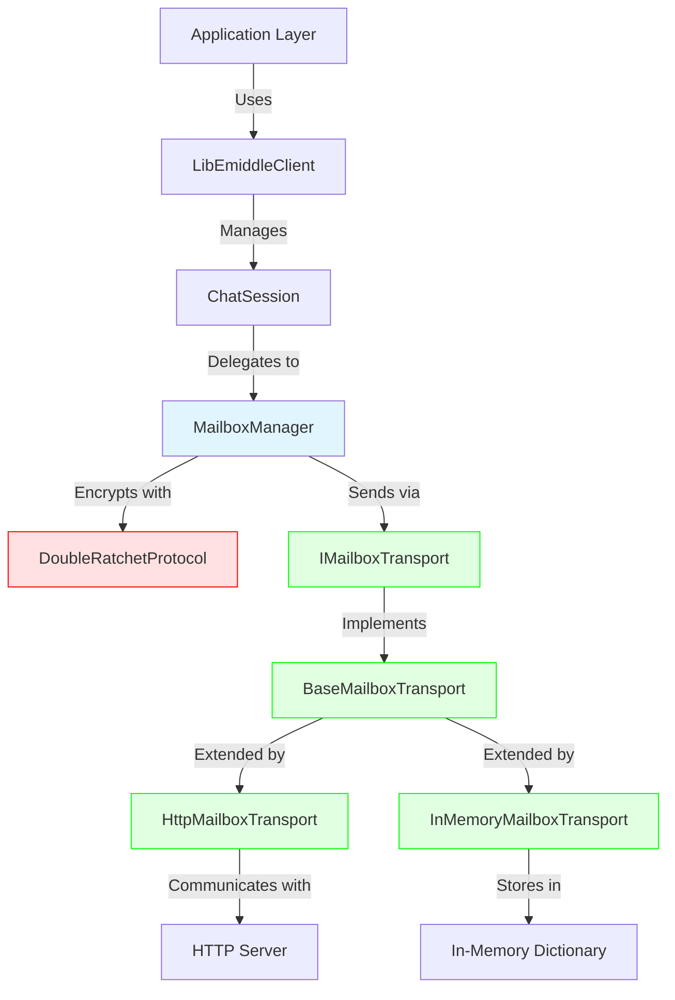
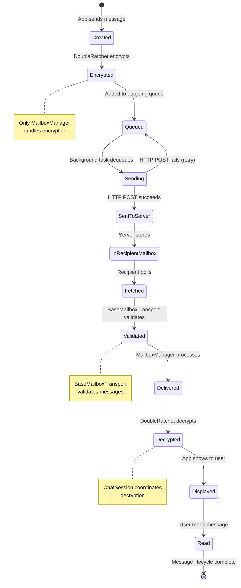
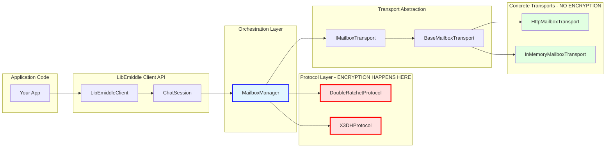

# Message Flow Sequence Diagram

This document provides detailed Mermaid sequence diagrams showing the complete message flow through the LibEmiddle mailbox transport system.

## Complete Message Sending Flow

## Complete Message Receiving Flow

## Simplified Layer View

## Message State Transitions

## Component Responsibilities

## Key Takeaways

### Encryption Happens Once
- ✅ **MailboxManager** encrypts messages using **DoubleRatchetProtocol**
- ❌ Transport layers never see plaintext
- ❌ Transport layers never perform encryption/decryption

### Message Flow Layers
1. **Application**: Sends plaintext "Hello!"
2. **LibEmiddleClient**: Routes to appropriate ChatSession
3. **ChatSession**: Coordinates encryption
4. **MailboxManager**: Performs encryption, creates MailboxMessage
5. **IMailboxTransport**: Abstract transport interface
6. **BaseMailboxTransport**: Common validation and logging
7. **Concrete Transport**: Actual delivery (HTTP, InMemory, etc.)
8. **Server/Storage**: Stores encrypted MailboxMessage

### Receiving is the Reverse
1. **Server/Storage**: Stores encrypted messages
2. **Concrete Transport**: Polls for new messages
3. **BaseMailboxTransport**: Validates messages
4. **IMailboxTransport**: Raises events
5. **MailboxManager**: Decrypts using DoubleRatchet
6. **ChatSession**: Coordinates decryption
7. **LibEmiddleClient**: Forwards to application
8. **Application**: Receives plaintext "Hello!"

### Important Architecture Notes

- **Single Responsibility**: Each layer has one clear job
- **Separation of Concerns**: Transport ≠ Encryption
- **Event-Driven**: Messages flow through events
- **Async Throughout**: All operations are async
- **Validation at Boundaries**: BaseMailboxTransport validates before processing
