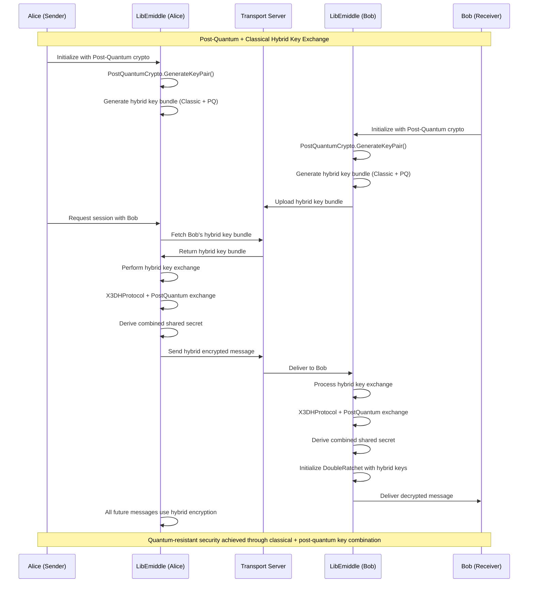

```mermaid
sequenceDiagram
    participant Alice as Alice (Sender)
    participant AliceLib as LibEmiddle (Alice)
    participant Server as Transport Server
    participant BobLib as LibEmiddle (Bob)
    participant Bob as Bob (Receiver)

    Note over Alice, Bob: Post-Quantum + Classical Hybrid Key Exchange

    Alice->>AliceLib: Initialize with Post-Quantum crypto
    AliceLib->>AliceLib: PostQuantumCrypto.GenerateKeyPair()
    AliceLib->>AliceLib: Generate hybrid key bundle (Classic + PQ)

    Bob->>BobLib: Initialize with Post-Quantum crypto
    BobLib->>BobLib: PostQuantumCrypto.GenerateKeyPair()
    BobLib->>BobLib: Generate hybrid key bundle (Classic + PQ)
    BobLib->>Server: Upload hybrid key bundle

    Alice->>AliceLib: Request session with Bob
    AliceLib->>Server: Fetch Bob's hybrid key bundle
    Server->>AliceLib: Return hybrid key bundle

    AliceLib->>AliceLib: Perform hybrid key exchange
    AliceLib->>AliceLib: X3DHProtocol + PostQuantum exchange
    AliceLib->>AliceLib: Derive combined shared secret

    AliceLib->>Server: Send hybrid encrypted message
    Server->>BobLib: Deliver to Bob

    BobLib->>BobLib: Process hybrid key exchange
    BobLib->>BobLib: X3DHProtocol + PostQuantum exchange  
    BobLib->>BobLib: Derive combined shared secret
    BobLib->>BobLib: Initialize DoubleRatchet with hybrid keys
    BobLib->>Bob: Deliver decrypted message

    AliceLib->>AliceLib: All future messages use hybrid encryption
    
    Note over Alice, Bob: Quantum-resistant security achieved through classical + post-quantum key combination
```